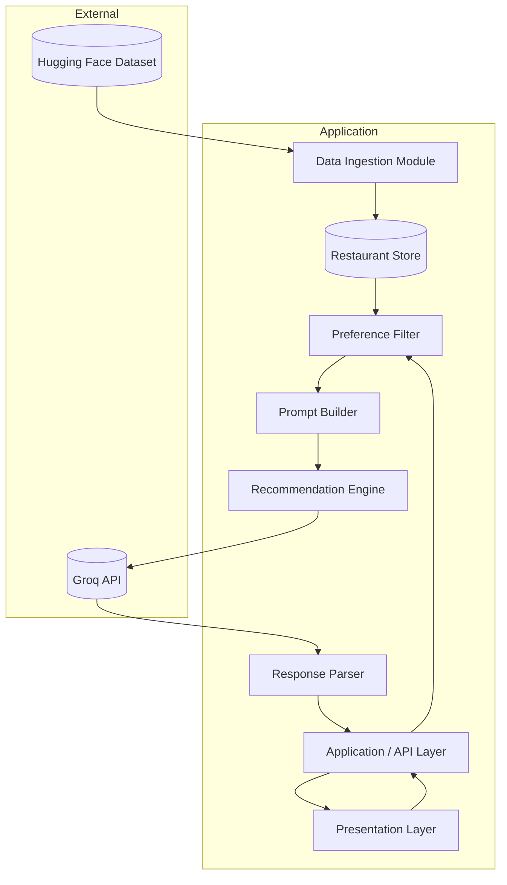
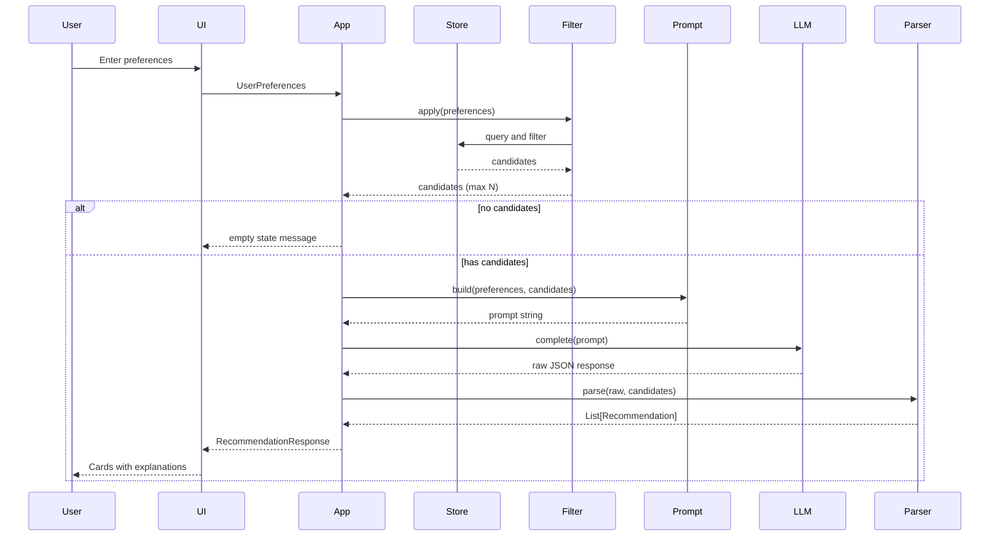

# System Architecture: AI-Powered Restaurant Recommendation System

This document describes the technical architecture for the Zomato-inspired restaurant recommendation service defined in [context.md](./context.md). It expands the high-level workflow into components, interfaces, data models, and operational concerns suitable for implementation and review.

---

## 1. Architectural Goals

| Goal | Description |
|------|-------------|
| **Grounded recommendations** | Every suggested restaurant must exist in the filtered dataset; the LLM ranks and explains—it does not invent venues. |
| **Separation of concerns** | Data loading, filtering, LLM reasoning, and presentation are isolated modules with clear contracts. |
| **Explainability** | Each recommendation includes an AI-generated rationale tied to explicit user preferences. |
| **Maintainability** | Swappable LLM provider, UI framework, and storage without rewriting core logic. |
| **Testability** | Deterministic filtering and mockable LLM responses enable unit and integration tests. |

---

## 2. High-Level Architecture

The system follows a **pipeline architecture**: structured data is narrowed by rules, then enriched and ranked by an LLM, then rendered to the user.



### Layer Summary

| Layer | Responsibility |
|-------|----------------|
| **Presentation** | Collect preferences; display ranked results with explanations. |
| **Application / API** | Orchestrate the recommendation pipeline; validate input; handle errors. |
| **Data Ingestion** | Load, clean, normalize, and persist restaurant records. |
| **Integration** | Filter candidates; build LLM prompts from structured context. |
| **Recommendation Engine** | Invoke LLM; parse ranked output and explanations. |
| **External Services** | Hugging Face (dataset), [Groq](https://groq.com/) (LLM inference). |

---

## 3. Component Design

### 3.1 Data Ingestion Module

**Purpose:** Bootstrap the application with a normalized view of the Zomato dataset.

| Aspect | Detail |
|--------|--------|
| **Source** | [ManikaSaini/zomato-restaurant-recommendation](https://huggingface.co/datasets/ManikaSaini/zomato-restaurant-recommendation) via `datasets` library or equivalent |
| **Trigger** | On application startup, CLI command, or scheduled job |
| **Output** | In-memory collection, local cache (JSON/Parquet), or lightweight DB |

**Processing steps:**

1. **Load** — Fetch dataset split(s) from Hugging Face.
2. **Extract** — Map raw columns to canonical fields (see [§5 Data Model](#5-data-model)).
3. **Clean** — Handle nulls, trim strings, normalize location and cuisine strings (case, aliases).
4. **Hyderabad Seeding** — Inject a robust set of synthetic Hyderabad restaurants (covering areas like Madhapur, Bachupally, Miyapur, Suchitra, etc.) to ensure multi-city support since the base dataset is Bangalore-centric.
5. **Normalize** — Coerce ratings to numeric; map cost to budget tiers (`low` / `medium` / `high`).
6. **Index** — Optional: build indexes on `location`, `cuisine`, `budget_tier`, `rating` for fast filtering.

**Design notes:**

- Ingestion runs **offline** relative to user requests; users never wait on Hugging Face at query time if data is cached.
- Log record counts and schema mismatches; fail loudly if required columns are missing.
- Version the processed snapshot (e.g., `dataset_version`, `ingested_at`) for reproducibility.

```
┌──────────────┐    load     ┌─────────────┐   transform   ┌────────────────┐
│ Hugging Face │ ──────────▶ │ Raw Records │ ──────────────▶ │ RestaurantStore │
└──────────────┘             └─────────────┘                 └────────────────┘
```

---

### 3.2 Restaurant Store

**Purpose:** Single source of truth for structured restaurant data used by the filter and prompt builder.

| Storage option | When to use |
|----------------|-------------|
| In-memory list / DataFrame | Prototypes, small datasets, single-process apps |
| Parquet / SQLite file | Local persistence, faster restarts |
| PostgreSQL / similar | Multi-user production, concurrent reads |

**Interface (conceptual):**

```text
get_all() -> List[Restaurant]
query(filters: FilterCriteria) -> List[Restaurant]
get_by_ids(ids: List[str]) -> List[Restaurant]
```

The store exposes **read-only** access after ingestion; updates require re-ingestion.

---

### 3.3 User Input & Presentation Layer

**Purpose:** Capture preferences and render recommendations.

**Collected fields (from context):**

| Field | Type | Validation |
|-------|------|------------|
| `location` | string | Required; match known cities or fuzzy match |
| `budget` | enum: `low`, `medium`, `high` | Required |
| `cuisine` | string | Required or optional with “any” |
| `min_rating` | float | Optional; range e.g. 0.0–5.0 |
| `additional_preferences` | string or list | Optional free text (e.g., family-friendly, quick service) |

**UI patterns:**

- **Web app** — Form + results cards (Streamlit, React, etc.).
- **CLI** — Prompted inputs + formatted table output.
- **API-only** — JSON request/response for integration tests or mobile clients.

**Presentation contract for each result:**

| Display field | Source |
|---------------|--------|
| Restaurant name | `Restaurant.name` |
| Cuisine | `Restaurant.cuisine` |
| Rating | `Restaurant.rating` |
| Estimated cost | `Restaurant.cost` or `budget_tier` label |
| AI explanation | Parsed from LLM response |

---

### 3.4 Application / Orchestration Layer

**Purpose:** Coordinate the end-to-end recommendation flow.

**Primary flow:**

```text
POST /recommend
  1. Validate UserPreferences
  2. candidates = Filter.apply(store, preferences)
  3. If candidates empty → return friendly message (no LLM call)
  4. prompt = PromptBuilder.build(preferences, candidates)
  5. raw = RecommendationEngine.rank_and_explain(prompt)
  6. results = ResponseParser.parse(raw, candidates)
  7. Return RecommendationResponse
```

**Cross-cutting concerns:**

- Request logging (preferences hash, candidate count, latency).
- Timeouts and retries for LLM calls.
- Rate limiting if exposed as a public API.
- Configuration via environment variables (API keys, model name, max candidates).

---

### 3.5 Integration Layer: Preference Filter

**Purpose:** Deterministically reduce the dataset to a relevant candidate set **before** calling the LLM.

**Filter logic (AND semantics unless noted):**

| Preference | Filter rule |
|------------|-------------|
| Location | Case-insensitive match on city or neighborhood area (`metadata.area`); optional substring |
| Budget | Map user tier to cost ranges or `budget_tier` column |
| Cuisine | Match if cuisine string contains requested type (multi-cuisine supported) |
| Min rating | `rating >= min_rating` |
| Additional | Not applied in SQL-like filter; passed to LLM for soft ranking |

**Candidate cap:**

- Limit to top **N** records (e.g., 20–50) by rating or relevance score to control token usage and latency.
- If count exceeds cap, pre-sort by rating descending, then send to LLM.

**Output:** `List[Restaurant]` — only real rows from the store; IDs preserved for grounding validation after LLM response.

---

### 3.6 Integration Layer: Prompt Builder

**Purpose:** Construct a structured prompt so the LLM can reason, rank, and explain without hallucinating new restaurants.

**Prompt structure:**

```text
[System]
You are a restaurant recommendation assistant. You may ONLY recommend
restaurants from the CANDIDATE_LIST below. Do not invent restaurants.
Return valid JSON matching the schema provided.

[User preferences]
- Location: {location}
- Budget: {budget}
- Cuisine: {cuisine}
- Minimum rating: {min_rating}
- Additional: {additional_preferences}

[CANDIDATE_LIST]
{json_array_of_restaurants}

[Task]
1. Rank the top {k} restaurants for these preferences.
2. For each, write a 1–2 sentence explanation referencing specific preferences.
3. Optionally provide a brief summary of the overall selection.

[Output schema]
{
  "summary": "string (optional)",
  "recommendations": [
    {
      "restaurant_id": "string",
      "rank": 1,
      "explanation": "string"
    }
  ]
}
```

**Design principles:**

- Include **restaurant_id** in every candidate so the parser can join back to structured fields.
- Keep candidate JSON compact (only fields needed for reasoning).
- Use low temperature for ranking consistency.
- Request **JSON-only** output to simplify parsing.

---

### 3.7 Recommendation Engine

**Purpose:** Call the LLM and return raw completion text.

| Concern | Approach |
|---------|----------|
| **Provider** | **[Groq](https://console.groq.com/docs)** (production) — Groq Chat Completions API; `MockLLMClient` for tests/CI (OpenAI is NOT used) |
| **Adapter interface** | `complete(prompt: str, config: LLMConfig) -> str` in `src/llm/client.py` |
| **Config** | `GROQ_API_KEY` (or `LLM_API_KEY`), `LLM_MODEL` (e.g. `llama-3.3-70b-versatile`), `temperature`, `max_tokens`, `timeout` |
| **Failure modes** | Retry on transient errors; fallback message on persistent failure |

**Groq integration (Phase 4):** `RecommendationService` and `create_llm_client()` select `GroqLLMClient` when a Groq API key is configured. The adapter uses the official `groq` Python SDK (or HTTP) against Groq’s chat completions endpoint—Groq is used exclusively, and OpenAI is not used.

**Responsibilities (strict):**

- Send prompt to provider.
- Return raw string.
- **Does not** merge with restaurant data—that belongs to `ResponseParser`.

---

### 3.8 Response Parser & Grounding Validator

**Purpose:** Convert LLM output into typed `Recommendation` objects and enforce grounding.

**Steps:**

1. Parse JSON from LLM response (strip markdown fences if present).
2. For each `restaurant_id` in the response:
   - Verify ID exists in the **candidate list** passed to the prompt.
   - Attach `name`, `cuisine`, `rating`, `cost` from the store (not from LLM text).
3. Drop or flag any ID not in candidates (hallucination guard).
4. Sort by `rank`.
5. If parsing fails, return structured error + optional retry with repair prompt.

**Grounding rule:** Display fields for name, cuisine, rating, and cost always come from **dataset records**, not from free-form LLM prose.

---

## 4. End-to-End Data Flow



---

## 5. Data Model

### 5.1 Restaurant (canonical)

| Field | Type | Description |
|-------|------|-------------|
| `id` | string | Stable identifier (generated or from dataset) |
| `name` | string | Restaurant name |
| `location` | string | City / area |
| `cuisine` | string | Cuisine type(s); may be comma-separated |
| `cost` | string or number | Raw cost from dataset |
| `budget_tier` | enum | Derived: `low`, `medium`, `high` |
| `rating` | float | Aggregate rating |
| `metadata` | object | Optional extra fields from dataset |

### 5.2 UserPreferences

```json
{
  "location": "Bangalore",
  "budget": "medium",
  "cuisine": "Italian",
  "min_rating": 4.0,
  "additional_preferences": "family-friendly, quick service"
}
```

### 5.3 Recommendation (API response item)

```json
{
  "rank": 1,
  "restaurant": {
    "id": "r_123",
    "name": "Example Bistro",
    "cuisine": "Italian",
    "rating": 4.5,
    "cost": "₹800 for two"
  },
  "explanation": "Matches your medium budget and 4+ rating preference in Bangalore with Italian cuisine."
}
```

### 5.4 RecommendationResponse

```json
{
  "summary": "Three strong Italian options in Bangalore for families.",
  "recommendations": [ "..." ],
  "meta": {
    "candidate_count": 12,
    "model": "llama-3.3-70b-versatile",
    "latency_ms": 1200
  }
}
```

---

## 6. Suggested Project Structure

Logical layout for a Python-based implementation (adaptable to other stacks):

```text
zomato-milestone/
├── docs/
│   ├── context.md
│   ├── architecture.md
│   └── problemStatement.txt
├── src/
│   ├── ingestion/
│   │   ├── loader.py          # Hugging Face load
│   │   └── normalizer.py      # clean + budget tiers
│   ├── store/
│   │   └── restaurant_store.py
│   ├── filters/
│   │   └── preference_filter.py
│   ├── llm/
│   │   ├── client.py          # provider adapter
│   │   ├── prompt_builder.py
│   │   └── response_parser.py
│   ├── models/
│   │   ├── restaurant.py
│   │   ├── preferences.py
│   │   └── recommendation.py
│   ├── services/
│   │   └── recommendation_service.py  # orchestration
│   └── app/
│       ├── main.py            # CLI or FastAPI/Streamlit entry
│       └── routes.py          # HTTP routes if applicable
├── tests/
│   ├── test_filter.py
│   ├── test_prompt_builder.py
│   └── test_response_parser.py
├── data/                      # cached processed dataset (gitignored)
├── .env.example
└── requirements.txt
```

---

## 7. API Contract (Optional HTTP Layer)

| Method | Path | Description |
|--------|------|-------------|
| `GET` | `/health` | Liveness; reports dataset loaded |
| `GET` | `/locations` | Dynamic list of unique cities and neighborhoods in the dataset for autocomplete dropdown |
| `POST` | `/recommend` | Body: `UserPreferences`; returns `RecommendationResponse` |
| `POST` | `/admin/ingest` | Trigger re-ingestion (protected in production) |

**Example `POST /recommend`:**

Request:

```json
{
  "location": "Delhi",
  "budget": "low",
  "cuisine": "Chinese",
  "min_rating": 3.5,
  "additional_preferences": "quick service",
  "top_k": 5
}
```

Response `200`:

```json
{
  "summary": "...",
  "recommendations": [ "..." ],
  "meta": { "candidate_count": 8 }
}
```

Response `422`: Validation error (invalid budget, missing location).

Response `404` / empty payload: No restaurants match filters.

---

## 8. Configuration & Secrets

| Variable | Purpose |
|----------|---------|
| `GROQ_API_KEY` | Groq API authentication key |
| `LLM_API_KEY` | Alias for `GROQ_API_KEY` (backward-compatible; maps to Groq, not OpenAI) |
| `LLM_MODEL` | Groq model id (e.g. `llama-3.3-70b-versatile`, `llama-3.1-8b-instant`) |
| `LLM_MAX_TOKENS` | Cap completion size |
| `LLM_TEMPERATURE` | Sampling temperature (low for consistent ranking) |
| `LLM_TIMEOUT` | Request timeout (seconds) |
| `LLM_MAX_RETRIES` | Retries on transient Groq errors |
| `MAX_CANDIDATES` | Filter cap before prompt |
| `TOP_K` | Default number of recommendations |
| `DATA_CACHE_PATH` | Local path for processed data |
| `HF_DATASET_NAME` | Override dataset id if needed |

Never commit `.env` or API keys; document required variables in `.env.example`.

---

## 9. Error Handling & Edge Cases

| Scenario | Behavior |
|----------|----------|
| Dataset load failure | Fail startup or show admin error; do not serve recommendations |
| Zero candidates after filter | Return user message: broaden location, budget, or cuisine |
| LLM timeout | Retry once; then return error with partial/filter-only fallback optional |
| Invalid JSON from LLM | Retry with “fix JSON” prompt; log raw response |
| Hallucinated `restaurant_id` | Strip invalid entries; log warning |
| All IDs invalid | Treat as LLM failure; do not show ungrounded names |

---

## 10. Non-Functional Requirements

| Area | Target |
|------|--------|
| **Latency** | Filter &lt; 100 ms; LLM dominates (aim &lt; 5 s P95 for interactive UI) |
| **Cost** | Cap candidates sent to LLM; use smaller models for dev |
| **Observability** | Log candidate count, token estimate, latency, parse success |
| **Security** | Validate all inputs; sanitize free-text preferences in logs |
| **Privacy** | No PII required; preferences are session-scoped unless extended |

---

## 11. Testing Strategy

| Level | Focus |
|-------|--------|
| **Unit** | Normalizer, budget mapping, filter rules, prompt template rendering, JSON parser |
| **Integration** | Mock LLM returns fixed JSON; verify grounded output fields |
| **Contract** | Snapshot tests for prompt structure and response schema |
| **E2E** | Load sample data → submit preferences → receive ranked cards |

**Mock LLM fixture:** Return deterministic ranking JSON for repeatable CI.

---

## 12. Deployment Views

### 12.1 Local / Development

```text
Developer machine
  └── Streamlit or CLI + local Parquet cache + Groq API key
```

### 12.2 Single-Container (Demo)

```text
Docker container
  ├── Pre-ingested data volume
  ├── FastAPI / Streamlit app
  └── Env: GROQ_API_KEY
```

### 12.3 Production-Ready (Future)

```text
                    ┌─────────────┐
  Users ──────────▶ │  Web / API  │
                    └──────┬──────┘
                           │
              ┌────────────┼────────────┐
              ▼            ▼            ▼
        ┌──────────┐  ┌──────────┐  ┌──────────┐
        │ App      │  │ Redis    │  │ Groq API │
        │ servers  │  │ cache    │  │          │
        └────┬─────┘  └──────────┘  └──────────┘
             ▼
        ┌──────────┐
        │ Postgres │
        │ (stores) │
        └──────────┘
```

---

## 13. Security Considerations

- Store API keys in environment or secret manager only.
- Rate-limit public `/recommend` to prevent LLM cost abuse.
- Validate enum fields (`budget`) and bound numeric inputs (`min_rating`).
- Do not execute user free-text as code; pass only as LLM context.
- If exposing `/admin/ingest`, require authentication.

---

## 14. Future Extensions

| Extension | Architectural impact |
|-----------|------------------------|
| User accounts & history | Add auth service + preference DB |
| Semantic search | Embedding index over descriptions; hybrid filter + vector retrieval |
| Feedback loop | Log clicks/ratings; fine-tune prompts or reranker |
| Multi-city trip planning | Extend preferences model; batch LLM calls |
| Caching recommendations | Hash `(preferences, dataset_version)` → cache LLM response |

---

## 15. Traceability to Context

| Context requirement | Architecture section |
|---------------------|----------------------|
| Hugging Face dataset ingestion | §3.1, §3.2 |
| User preference collection | §3.3, §5.2 |
| Filter + prompt integration | §3.5, §3.6 |
| LLM rank, explain, summarize | §3.7, §3.6 |
| Grounded, non-hallucinated results | §3.8, Design Considerations in context |
| Output: name, cuisine, rating, cost, explanation | §3.3, §5.3 |
| Success criteria | §3.5, §3.8, §10, §11 |

---

## 16. Summary

The system is a **grounded RAG-style pipeline without a vector database**: structured filtering selects candidates from the Zomato dataset, a carefully designed prompt supplies those candidates to an LLM for ranking and natural-language explanations, and a parser merges LLM output back onto canonical restaurant records for display. This separation keeps recommendations truthful, testable, and aligned with the objectives in [context.md](./context.md).
