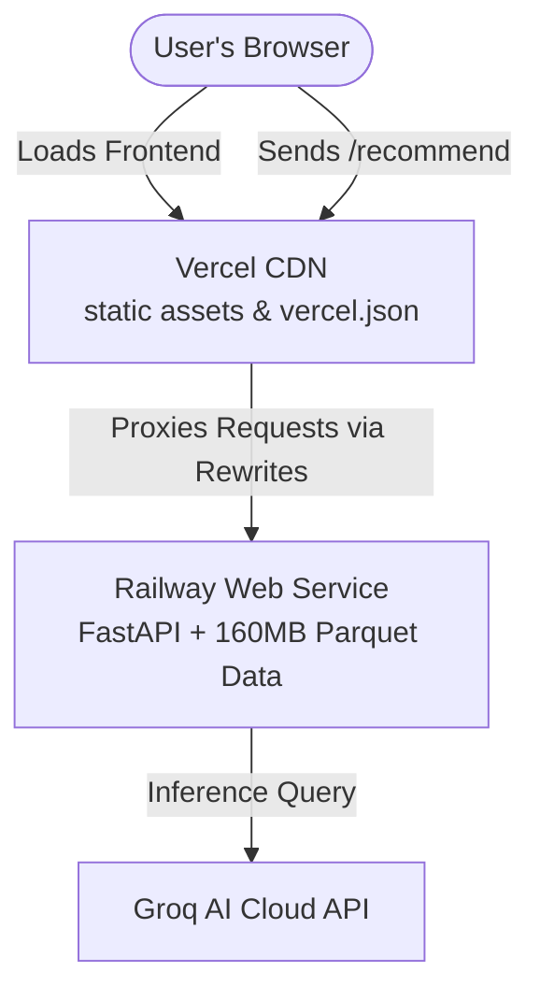

# Deployment Plan: Zomato Recommendation System

This plan details the step-by-step procedure to deploy the **Zomato AI Restaurant Recommendation System** using a split-architecture approach:
1. **Backend API (FastAPI)**: Deployed on **Railway** (to execute Python code and load the restaurant dataset).
2. **Frontend UI (HTML/CSS/JS)**: Deployed on **Vercel** (for lightning-fast global CDN delivery of static assets).

---

## 1. System Architecture



### Key Technical Considerations
* **The 160MB Parquet File**: The data engine loads a `restaurants.parquet` file of 160MB. Railway's starter environment provides **512MB RAM**. To prevent Out-Of-Memory (OOM) crashes, we provide memory optimization configurations.
* **CORS & Proxying**: Deploying the frontend on Vercel and the backend on Railway normally requires setting up complex CORS permissions. Instead, we will use **Vercel Rewrites (`vercel.json`)** to proxy `/recommend` and `/locations` requests from Vercel to Railway under-the-hood. This keeps URLs clean and avoids CORS issues.

---

## 2. Phase A: Backend Deployment on Railway

Railway will run your FastAPI server. It detects Python automatically via `requirements.txt` and starts the app.

### Step 1: Add a `Procfile`
Create a file named `Procfile` in the root of your repository to tell Railway exactly how to launch your Uvicorn server:
```text
web: uvicorn src.app.factory:app --host 0.0.0.0 --port $PORT
```

### Step 2: Ensure Data is Present
Since `data/restaurants.parquet` is 160MB, it might exceed standard GitHub file limits or push warnings if not tracked properly.
* Make sure `data/restaurants.parquet` is **not** in your `.gitignore` so that it gets pushed to GitHub and is available on Railway during build time.
* If you have Git LFS (Large File Storage) enabled, ensure Railway can pull LFS files (usually enabled by default).

### Step 3: Deploy on Railway
1. Go to [Railway](https://railway.app/) and sign in.
2. Click **New Project** -> **Deploy from GitHub repo**.
3. Choose your repository.
4. Railway will automatically start building the container using your `requirements.txt` and `Procfile`.

### Step 4: Configure Environment Variables
In the **Variables** tab of your Railway service, add the following environment variables:
* `GROQ_API_KEY`: *[Your Groq API Key]*
* `LLM_MODEL`: `llama-3.3-70b-versatile` (or `llama-3.1-8b-instant` for ultra-low latency)
* `DATA_CACHE_PATH`: `data/restaurants.parquet`
* `PYTHONUNBUFFERED`: `1`

### Step 5: Generate a Public Domain
1. Go to the **Settings** tab of your Railway service.
2. Under **Environment**, click **Generate Domain**.
3. Save this URL (e.g., `https://zomato-backend-production.up.railway.app`). You will need it for Vercel.

---

## 3. Phase B: Frontend Deployment on Vercel

Vercel will host your static files located in `src/static`. We will configure Vercel so that `src/static` is treated as the root directory, and set up a rewrite proxy to communicate with Railway.

### Step 1: Create `vercel.json`
Create a file named `vercel.json` in the **root** of your repository. This file will proxy requests made to `/recommend` and `/locations` directly to your Railway backend:

```json
{
  "version": 2,
  "public": true,
  "cleanUrls": true,
  "rewrites": [
    {
      "source": "/recommend",
      "destination": "https://YOUR-RAILWAY-APP-URL.up.railway.app/recommend"
    },
    {
      "source": "/locations",
      "destination": "https://YOUR-RAILWAY-APP-URL.up.railway.app/locations"
    },
    {
      "source": "/health",
      "destination": "https://YOUR-RAILWAY-APP-URL.up.railway.app/health"
    }
  ]
}
```
> [!IMPORTANT]
> Replace `https://YOUR-RAILWAY-APP-URL.up.railway.app` with the actual public Railway URL generated in **Phase A, Step 5**.

### Step 2: Deploy on Vercel
1. Go to [Vercel](https://vercel.com/) and sign in.
2. Click **Add New** -> **Project**.
3. Select your GitHub repository.
4. In the **Configure Project** settings:
   * **Framework Preset**: Select **Other**.
   * **Root Directory**: Click *Edit* and select **`src/static`** (This ensures `index.html`, `app.js`, and `style.css` are hosted at the root).
5. Click **Deploy**.

---

## 4. Phase C: Backend Memory Optimizations for Railway (512MB RAM)

Since the free trial/starter tiers on Railway have a **512MB RAM limit**, loading a 160MB Parquet dataset into a memory-intensive Pandas DataFrame can sometimes cause OOM (Out Of Memory) issues during high traffic. 

If you notice your Railway service restarting due to memory limits, implement the following optimizations:

### Optimization 1: Enable CORS in FastAPI (As a backup fallback)
If you decide not to use Vercel Rewrites and want your frontend to connect directly to Railway, add CORS middleware to `src/app/factory.py`:

```python
from fastapi.middleware.cors import CORSMiddleware

# Inside create_app() function:
application.add_middleware(
    CORSMiddleware,
    allow_origins=["*"], # Change to your Vercel URL in production
    allow_credentials=True,
    allow_methods=["*"],
    allow_headers=["*"],
)
```

### Optimization 2: Optimize Pandas Data Loading
In `src/store/restaurant_store.py`, optimize the loading of the Parquet file to drop unused columns early and cast data types to save RAM:

```python
# Instead of loading all columns, specify only what you need:
columns_to_load = ["id", "name", "location", "cuisine", "cost", "rating", "budget_tier"]
df = pd.read_parquet(path, columns=columns_to_load)
```

---

## 5. Verification & Testing

Once both systems are deployed:
1. Open your Vercel deployment URL in a browser.
2. Check the network tab in Developer Tools (`F12`) to verify that the initial `/locations` request succeeds and populates the location dropdown.
3. Test a recommendation preset (e.g., Bangalore Italian) and verify that:
   - A loading box appears.
   - The API successfully fetches `/recommend` without CORS issues.
   - Grounded suggestions with AI explanations render correctly.
