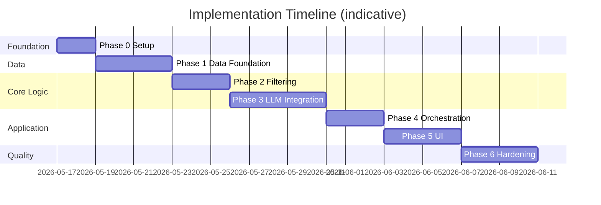
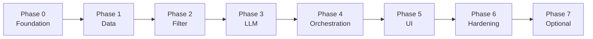

# Phase-Wise Implementation Plan

This plan translates [context.md](./context.md) and [architecture.md](./architecture.md) into ordered delivery phases. Each phase has clear goals, tasks, deliverables, and acceptance criteria so the team can ship incrementally with a working system at every milestone.

---

## Plan Overview




| Phase | Name                        | Primary outcome                             | Architecture refs |
| ----- | --------------------------- | ------------------------------------------- | ----------------- |
| **0** | Project foundation          | Repo, tooling, config skeleton              | §6, §8            |
| **1** | Data foundation             | Loaded, normalized Zomato dataset in store  | §3.1, §3.2, §5.1  |
| **2** | Preference filtering        | Deterministic candidate selection           | §3.5              |
| **3** | LLM integration             | Ranked, explained, grounded recommendations | §3.6, §3.7, §3.8  |
| **4** | Orchestration & API         | End-to-end service callable via API/CLI     | §3.4, §7          |
| **5** | Presentation layer          | User-facing app with full output contract   | §3.3, context §5  |
| **6** | Testing, hardening & deploy | Production-ready demo                       | §9–§13            |


**Estimated duration:** ~3–4 weeks for a solo developer; phases can overlap slightly where dependencies allow.

---

## Phase 0: Project Foundation

### Goal

Establish repository structure, dependencies, configuration, and development workflow so later phases plug into a consistent layout.

### Tasks


| #   | Task                      | Details                                                                                                                |
| --- | ------------------------- | ---------------------------------------------------------------------------------------------------------------------- |
| 0.1 | Initialize project layout | Create `src/`, `tests/`, `data/` per architecture §6                                                                   |
| 0.2 | Dependency management     | Add `requirements.txt` or `pyproject.toml`: `datasets`, `pandas`, `pydantic`, `groq`, `python-dotenv`, test runner    |
| 0.3 | Environment template      | Create `.env.example` with `GROQ_API_KEY`, `LLM_MODEL` (Groq model id), `MAX_CANDIDATES`, `TOP_K`, `DATA_CACHE_PATH`, `HF_DATASET_NAME` |
| 0.4 | Git hygiene               | Add `.gitignore` for `data/`, `.env`, `__pycache__`, virtualenv                                                        |
| 0.5 | Logging baseline          | Shared logger config (level, format) for ingestion and API                                                             |
| 0.6 | README stub               | Setup instructions: venv, install, env vars, run commands (expand in Phase 6)                                          |


### Deliverables

- Runnable empty project with importable `src` package
- Documented env variables matching architecture §8
- CI-ready test command (`pytest` or equivalent)

### Acceptance criteria

- `pip install -r requirements.txt` succeeds
- `pytest` runs (even with zero tests)
- `.env.example` lists all required configuration keys
- Project structure matches architecture §6

### Dependencies

None.

---

## Phase 1: Data Foundation

### Goal

Load the Hugging Face Zomato dataset, normalize it into canonical `Restaurant` records, and persist them in a `RestaurantStore` for fast read access.

**Maps to context:** Data Ingestion workflow, success criterion “real-world dataset.”

### Tasks


| #   | Task                   | Details                                                                                                                                       |
| --- | ---------------------- | --------------------------------------------------------------------------------------------------------------------------------------------- |
| 1.1 | Explore dataset schema | Inspect [HF dataset](https://huggingface.co/datasets/ManikaSaini/zomato-restaurant-recommendation); document column → canonical field mapping |
| 1.2 | Define data models     | Implement `Restaurant` in `src/models/restaurant.py` (§5.1): `id`, `name`, `location`, `cuisine`, `cost`, `budget_tier`, `rating`, `metadata` |
| 1.3 | Hugging Face loader    | `src/ingestion/loader.py`: load split(s) via `datasets` library                                                                               |
| 1.4 | Normalizer             | `src/ingestion/normalizer.py`: null handling, string trim, rating coercion, budget tier derivation (`low`/`medium`/`high`)                    |
| 1.5 | Stable IDs             | Generate or preserve unique `id` per row for grounding in later phases                                                                        |
| 1.6 | Restaurant store       | `src/store/restaurant_store.py`: `get_all()`, `get_by_ids()`; in-memory + optional Parquet cache at `DATA_CACHE_PATH`                         |
| 1.7 | Ingestion CLI/script   | Command or function to run load → normalize → save cache; log `ingested_at`, record count                                                     |
| 1.8 | Unit tests             | Tests for normalizer edge cases (missing rating, ambiguous cost, multi-cuisine strings)                                                       |
| 1.9 | Hyderabad mock seeding | Inject synthetic Hyderabad restaurant records (covering areas like Madhapur, Bachupally, Miyapur, Suchitra) in `src/ingestion/normalizer.py` to ensure multi-city support since the base dataset is Bangalore-only. |


### Deliverables

- Populated `RestaurantStore` with full dataset (including seeded Hyderabad restaurants)
- Cached processed file under `data/` (gitignored)
- Schema mapping note in code comments or docstring

### Acceptance criteria

- Dataset loads from Hugging Face without manual download steps
- Every record has non-empty `id`, `name`, `location`
- `budget_tier` is assigned for all rows used in filtering
- Reload from cache skips HF network call
- Ingestion pipeline automatically seeds synthetic Hyderabad records (with areas like Madhapur, Bachupally, Miyapur, Suchitra, etc.) into the store.
- Unit tests pass for normalizer, store read operations, and the Hyderabad mock seeder.
- Logs report total records (including seeded records) and any skipped/invalid rows

### Dependencies

Phase 0.

### Risks & mitigations


| Risk                             | Mitigation                                                       |
| -------------------------------- | ---------------------------------------------------------------- |
| HF schema differs from docs      | Inspect first 10 rows; adapt mapper with explicit column aliases |
| Large dataset slow on first load | Persist Parquet; ingest once in dev                              |


---

## Phase 2: Preference Filtering

### Goal

Implement deterministic filtering so user preferences narrow the dataset to a bounded candidate list **without** calling the LLM.

**Maps to context:** Integration layer (filter step), design consideration “grounding.”

### Tasks


| #   | Task                  | Details                                                                                                                   |
| --- | --------------------- | ------------------------------------------------------------------------------------------------------------------------- |
| 2.1 | UserPreferences model | `src/models/preferences.py`: `location`, `budget`, `cuisine`, `min_rating`, `additional_preferences`; Pydantic validation |
| 2.2 | Preference filter     | `src/filters/preference_filter.py`: AND logic per architecture §3.5                                                       |
| 2.3 | Location matching     | Case-insensitive city match; optional substring/fuzzy for typos                                                           |
| 2.4 | Budget mapping        | Filter on `budget_tier` aligned with user `low`/`medium`/`high`                                                           |
| 2.5 | Cuisine matching      | Substring match on multi-value cuisine field                                                                              |
| 2.6 | Rating filter         | `rating >= min_rating` when provided                                                                                      |
| 2.7 | Candidate cap         | Sort by rating desc; limit to `MAX_CANDIDATES` (e.g. 30)                                                                  |
| 2.8 | Filter-only CLI       | Temporary script: input preferences → print candidate table (validates Phase 1+2 before LLM cost)                         |
| 2.9 | Unit tests            | Fixtures with known restaurants; assert filter outcomes and cap behavior                                                  |


### Deliverables

- `PreferenceFilter.apply(store, preferences) -> List[Restaurant]`
- Test suite covering all filter dimensions and empty-result case

### Acceptance criteria

- Valid preferences return only matching restaurants from store
- Empty result returns `[]` without error
- Candidate list never exceeds `MAX_CANDIDATES`
- `additional_preferences` is **not** used in hard filter (reserved for LLM)
- Filter completes in < 100 ms on full dataset (local)
- All unit tests pass

### Dependencies

Phase 1.

---

## Phase 3: LLM Integration

### Goal

Build the prompt, LLM client, and response parser so the system returns **grounded**, ranked recommendations with explanations.

**Maps to context:** Recommendation engine (rank, explain, summarize); design considerations (grounding, prompt design, transparency).

### Tasks


| #   | Task                  | Details                                                                                                                                |
| --- | --------------------- | -------------------------------------------------------------------------------------------------------------------------------------- |
| 3.1 | Recommendation models | `src/models/recommendation.py`: `Recommendation`, `RecommendationResponse` per §5.3–5.4                                                |
| 3.2 | LLM client adapter    | `src/llm/client.py`: `complete(prompt, config) -> str`; provider-agnostic interface + `MockLLMClient` for tests                          |
| 3.3 | Mock LLM for tests    | Fixed JSON response fixture for CI without API key                                                                                     |
| 3.4 | Prompt builder        | `src/llm/prompt_builder.py`: system rules, preferences block, compact `CANDIDATE_LIST` JSON with `restaurant_id`, output schema (§3.6) |
| 3.5 | Response parser       | `src/llm/response_parser.py`: strip markdown fences, parse JSON, join IDs to candidates                                                |
| 3.6 | Grounding validator   | Reject IDs not in candidate list; attach name/cuisine/rating/cost from store only                                                      |
| 3.7 | Error handling        | Retry on transient LLM errors; repair prompt on invalid JSON (§9)                                                                      |
| 3.8 | Integration tests     | Mock LLM → full parse path; hallucinated ID stripped; sort by `rank`                                                                   |
| 3.9 | Manual smoke test     | Run with `--mock` or Groq API (after Phase 4 wiring); verify explanations reference preferences                                        |


### Deliverables

- `PromptBuilder.build(preferences, candidates, top_k) -> str`
- `ResponseParser.parse(raw, candidates) -> RecommendationResponse`
- Mock LLM path; live Groq client wired in Phase 4

### Acceptance criteria

- Prompt includes only provided candidates with `restaurant_id`
- Parser never surfaces restaurant names absent from candidate list
- Display fields (name, cuisine, rating, cost) come from dataset, not LLM free text
- Optional `summary` field populated when LLM returns it
- Invalid JSON triggers retry or clear error (no silent failure)
- Integration tests pass with mock LLM (no network in CI)

### Dependencies

Phase 2.

### Risks & mitigations


| Risk                | Mitigation                                               |
| ------------------- | -------------------------------------------------------- |
| LLM cost during dev | Mock client default in tests; cap candidates             |
| Non-JSON responses  | Explicit schema in prompt; repair retry; low temperature |
| Hallucinated IDs    | Grounding validator; log warnings                        |


---

## Phase 4: Orchestration & API

### Goal

Wire all modules into a single recommendation pipeline exposed via a service layer and HTTP/CLI entry point. **Production LLM inference exclusively uses [Groq](https://groq.com/)** (OpenAI is NOT used).

**Maps to context:** Full system workflow end-to-end (minus polished UI).

### Tasks


| #   | Task                           | Details                                                                              |
| --- | ------------------------------ | ------------------------------------------------------------------------------------ |
| 4.1 | Groq LLM client                | `src/llm/client.py`: `GroqLLMClient` using `groq` SDK + Chat Completions; read `GROQ_API_KEY`, `LLM_MODEL` |
| 4.2 | Client factory                 | `create_llm_client()` returns `GroqLLMClient` when Groq key set; `MockLLMClient` for tests/CI |
| 4.3 | Recommendation service         | `src/services/recommendation_service.py`: orchestration flow §3.4 (filter → Groq → parse) |
| 4.4 | Empty-state handling           | Skip LLM when `candidates` empty; return friendly message                            |
| 4.5 | Request validation             | Budget enum, rating bounds, required `location`                                      |
| 4.6 | FastAPI routes (or equivalent) | `GET /health`, `POST /recommend` per §7                                              |
| 4.7 | Health check                   | Report dataset loaded, record count, `ingested_at`                                   |
| 4.8 | Response metadata              | Include `candidate_count`, `latency_ms`, Groq `model` in `meta`                      |
| 4.9 | Startup lifecycle              | Load store from cache on app start; fail fast if data missing                        |
| 4.10 | CLI entry                     | `src/app/main.py`: argparse or interactive prompts → call service → print JSON/table |
| 4.11 | API integration tests         | `TestClient` against `/recommend` with mock LLM (no Groq network in CI)              |
| 4.12 | Dynamic locations endpoint    | `GET /locations` returning unique, pre-computed cities and neighborhood area names from Zomato store |


### Deliverables

- `GroqLLMClient` and updated `create_llm_client()` factory
- `RecommendationService.recommend(preferences) -> RecommendationResponse`
- Runnable API server and CLI backed by Groq in production
- OpenAPI docs (auto-generated if FastAPI)
- `.env.example` documents `GROQ_API_KEY` and default Groq model ids

### Acceptance criteria

- Live recommendations call **Groq** when `GROQ_API_KEY` (or `LLM_API_KEY`) is set—no OpenAI dependency (OpenAI is not used)
- `POST /recommend` returns ranked list matching §5.3 schema
- `GET /health` returns 200 when data is loaded
- Invalid body returns 422 with clear validation errors
- Zero candidates returns structured empty response (no LLM call)
- End-to-end CLI run: preferences in → Groq-ranked recommendations out
- Logs include candidate count, Groq model id, and request latency
- CI uses `MockLLMClient` only (no Groq API key required)

### Dependencies

Phases 1–3.

### Groq configuration (reference)

| Variable | Example | Notes |
|----------|---------|-------|
| `GROQ_API_KEY` | `gsk_...` | From [Groq Console](https://console.groq.com/keys) |
| `LLM_MODEL` | `llama-3.3-70b-versatile` | Fast, capable default; or `llama-3.1-8b-instant` for lower latency |
| `LLM_TEMPERATURE` | `0.2` | Low temperature for stable ranking |

---

## Phase 5: Presentation Layer

### Goal

Deliver a user-friendly interface that collects all preference fields and displays results per the output contract.

**Maps to context:** User input collection; output display (name, cuisine, rating, cost, AI explanation).

### Tasks


| #   | Task             | Details                                                                                |
| --- | ---------------- | -------------------------------------------------------------------------------------- |
| 5.1 | Choose UI stack  | Streamlit (fastest) or web form + API client—align with team skills                    |
| 5.2 | Preference form  | Fields: location, budget (select), cuisine, min rating (slider), additional (textarea) |
| 5.3 | Input validation | Client-side hints; server-side validation via API                                      |
| 5.4 | Results view     | Cards/rows: name, cuisine, rating, cost, explanation, rank badge                       |
| 5.5 | Optional summary | Show LLM `summary` above results when present                                          |
| 5.6 | Loading & errors | Spinner during LLM call; empty state and API error messages                            |
| 5.7 | Sample presets   | Quick-fill examples (e.g. “Bangalore · medium · Italian”) for demos                    |
| 5.8 | UX polish        | Consistent spacing, readable typography, mobile-friendly layout                        |
| 5.9 | Dynamic location autocomplete | Fetch `/locations` on load and populate the dropdown dynamically, including Bangalore neighborhoods (Indiranagar, Bellandur) and Hyderabad areas (Madhapur, Bachupally, Miyapur, Suchitra, etc.). |


### Deliverables

- Runnable web UI connected to `RecommendationService` or `/recommend`
- Demo-ready screens for milestone review

### Acceptance criteria

- All preference fields from context.md are collectable
- Location autocomplete dropdown displays both Bangalore areas and seeded Hyderabad areas (Madhapur, Bachupally, Miyapur, Suchitra, etc.)
- Selecting a Hyderabad area and submitting successfully displays grounded, ranked recommendations (e.g. Bawarchi Biryani, Pista House) with AI-generated explanations
- Each result shows: name, cuisine, rating, estimated cost, AI explanation
- Empty filter result shows actionable message (broaden search)
- UI remains responsive during LLM wait (loading indicator)
- Successful demo path: form submit → top 5 recommendations displayed

### Dependencies

Phase 4.

---

## Phase 6: Testing, Hardening & Deployment

### Goal

Reach milestone quality: reliable tests, documented setup, error resilience, and a deployable demo artifact.

**Maps to context:** Success criteria; architecture §9–§13.

### Tasks


| #    | Task                    | Details                                                                            |
| ---- | ----------------------- | ---------------------------------------------------------------------------------- |
| 6.1  | Test coverage gap fill  | Unit + integration per §11; target critical paths ≥ 80%                            |
| 6.2  | E2E test                | Load sample data → UI or API → assert response shape                               |
| 6.3  | Contract/snapshot tests | Prompt template and response JSON snapshots                                        |
| 6.4  | Observability           | Structured logs: preferences hash, tokens estimate (optional), parse success       |
| 6.5  | Security pass           | No secrets in repo; input sanitization; document rate-limit note for public deploy |
| 6.6  | README complete         | Install, ingest, run API, run UI, test, env vars                                   |
| 6.7  | Docker (optional)       | Dockerfile with pre-ingested data volume for demo                                  |
| 6.8  | Performance check       | Filter < 100 ms; document typical LLM latency                                      |
| 6.9  | Manual QA checklist     | Execute scenarios from §9 edge cases                                               |
| 6.10 | Final demo script       | 3–5 preference scenarios showcasing grounding and explanations                     |


### Deliverables

- CI pipeline running tests on push
- Complete README
- Optional `Dockerfile` + `docker-compose.yml`
- QA checklist (in README or `docs/qa-checklist.md`)

### Acceptance criteria

- All success criteria from context.md verified (see checklist below)
- CI green on unit, integration, E2E tests
- Fresh clone + README steps → working recommendations
- Edge cases handled: no candidates, LLM timeout, bad JSON, hallucinated IDs
- Demo script runs without ad-hoc fixes

### Dependencies

Phase 5.

### Milestone success checklist (from context)


| Criterion                                    | Verification                                      |
| -------------------------------------------- | ------------------------------------------------- |
| Preferences narrow candidate set             | Phase 2 filter tests + API meta `candidate_count` |
| LLM ranked recommendations with explanations | Phase 3–5 manual + integration tests              |
| Consistent output fields                     | Phase 5 UI + API schema validation                |
| Grounded recommendations only                | Phase 3 grounding tests                           |


---

## Phase 7 (Optional): Enhancements

Post-MVP items from architecture §14. Implement only after Phase 6 sign-off.


| Item                     | Scope                                                    | Priority |
| ------------------------ | -------------------------------------------------------- | -------- |
| Response caching         | Hash `(preferences, dataset_version)` → cache LLM output | Medium   |
| Admin re-ingest endpoint | `POST /admin/ingest` with auth                           | Low      |
| Semantic search          | Embeddings over descriptions + hybrid retrieval          | Low      |
| User feedback logging    | Click/rating events for future tuning                    | Low      |
| Production deploy        | Postgres store, Redis cache, rate limiting               | Low      |


---

## Cross-Phase Dependency Graph




**Parallelization tips:**

- Phase 0.6 (README) can expand during Phase 6.
- Phase 3.4 (prompt builder) can start once Phase 2 sample candidates exist.
- Phase 5 UI mockups can start during Phase 4 with mocked API responses.

---

## Per-Phase Testing Summary


| Phase | Test focus                                                |
| ----- | --------------------------------------------------------- |
| 0     | Tooling smoke test                                        |
| 1     | Normalizer, store, loader                                 |
| 2     | Filter rules, cap, empty results                          |
| 3     | Prompt snapshots, parser, grounding, mock LLM integration |
| 4     | Service flow, API contracts, health                       |
| 5     | Manual UX, optional lightweight UI test                   |
| 6     | E2E, CI, edge cases, performance spot-check               |


---

## Suggested File Creation Order

Aligns with architecture §6; create files as each phase starts:

```text
Phase 0:  requirements.txt, .env.example, .gitignore, src/__init__.py
Phase 1:  models/restaurant.py, ingestion/*, store/restaurant_store.py
Phase 2:  models/preferences.py, filters/preference_filter.py
Phase 3:  models/recommendation.py, llm/client.py, llm/prompt_builder.py, llm/response_parser.py
Phase 4:  services/recommendation_service.py, app/main.py, app/routes.py
Phase 5:  app/ui.py (or streamlit_app.py)
Phase 6:  tests/*, Dockerfile, README.md
```

---

## Definition of Done (Project)

The project is **complete** when:

1. Zomato data is ingested from Hugging Face and cached locally.
2. Users submit location, budget, cuisine, min rating, and optional preferences.
3. The system filters candidates, calls an LLM, and returns grounded top recommendations.
4. Each result shows name, cuisine, rating, cost, and an AI explanation tied to preferences.
5. Tests run in CI; README enables a new developer to run the full stack.
6. A demo successfully walks through at least three distinct preference scenarios.

---

## Traceability Matrix


| Context / architecture capability | Phase   |
| --------------------------------- | ------- |
| HF dataset ingestion              | 1       |
| Canonical data model & store      | 1       |
| User preference model             | 2, 5    |
| Deterministic filtering           | 2       |
| Prompt with candidate list        | 3       |
| LLM rank & explain                | 3       |
| Grounding validation              | 3       |
| Orchestration pipeline            | 4       |
| HTTP API                          | 4       |
| User-facing output                | 5       |
| Error handling & edge cases       | 3, 4, 6 |
| Testing strategy                  | 1–6     |
| Deployment / Docker               | 6, 7    |


---

## Related Documents

- [context.md](./context.md) — Product goals, workflow, success criteria
- [architecture.md](./architecture.md) — Components, data models, APIs, NFRs
- [problemStatement.txt](./problemStatement.txt) — Original problem definition

